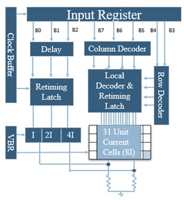

# 8-bit Segmented Current Steering DAC (180nm CMOS)

## 📌 Project Overview
**M.Tech Thesis Project**
This project involves the design and implementation of a 500 MS/s Current Steering Digital-to-Analog Converter using a 5+3 segmented architecture. The design focuses on high dynamic performance for wireless communication applications.

* **Technology:** 180nm CMOS
* **Supply Voltage:** 1.8V
* **Architecture:** 5-bit Unary + 3-bit Binary (Segmented)

## 📊 Performance Results
| Parameter | Value |
| :--- | :--- |
| **Sampling Rate** | 500 MS/s |
| **Resolution** | 8 bits |
| **ENOB** | 7.92 bits |
| **SFDR (Nyquist)** | 57.02 dBc |
| **SNDR** | 49.49 dB |
| **Power** | 3.21 mW |

## 📷 Design Views & Simulation Plots

### 1. Architecture

### 2. Ramp Output at Low Frequency

### 3. Sine Output at Low Frequency

### 4. SFDR Spectrum Performance

---
*Note: This repository contains documentation and simulation results. Proprietary PDK files are not included.*
